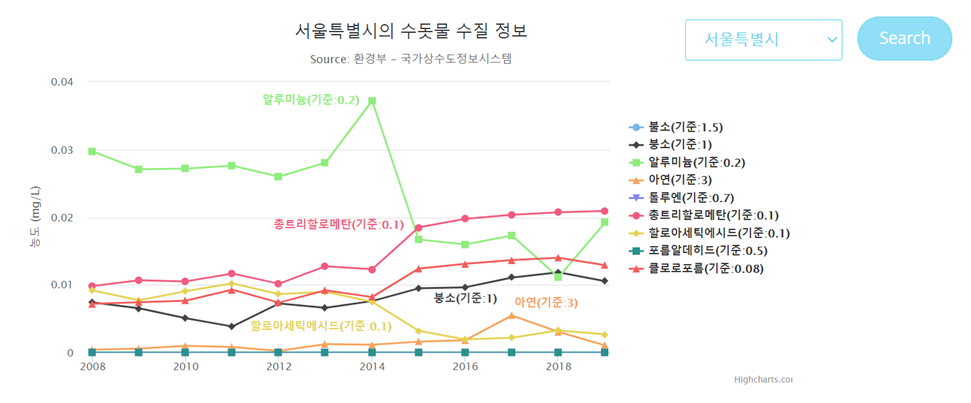

# 수질 데이터와 건강관련요인 데이터

> 수질 데이터로부터 의미있는 결과 얻어내기 위해 건강 데이터와 연관지어 분석하고자 함

> 이미 병태생리가 분명하게 밝혀진 질환과 연관짓기 보다는, 다양한 환경요소가 영향을 미칠 수 있는 질환 또는 건강지표를 예측하는 모델을 만들 계획

본 프로젝트는 `Python`을 기반으로 한 데이터 분석 결과를 `Django`를 이용하여 웹 어플리케이션으로 만들어 `Python Anywhere`를 통해 실제 웹상에 개재하는 것까지를 목표로 하였습니다.

이 문서는 프로젝트 단계별로 진행한 내용과 웹 어플리케이션으로 시각화한 방법에 대해 설명하고 있습니다.

- 저장소 내 '**myanalysis**' 폴더에 전처리부터 분석, 시각화 하는 코드가 포함되어 있습니다.
- 저장소 내 '**water > templates**' 폴더에 각 웹페이지의 코드가 포함되어 있습니다.

 

 

## 수질 데이터 분석

수질 데이터만 단독으로 사용한 분석으로, 방대한 자료의 전처리부터 수질 데이터에 적절한 분석방법과 그 시각화 방법에 대해 생각해보았습니다.

 

### 1. 데이터 전처리

- 수질 데이터는 향후 함께 분석할 건강지표 요인과 형태를 맞추기 위해서, 시도별 월별 데이터를 연평균 내어서 연도별 데이터로 만들었습니다.

- 데이터셋: 수돗물(정수) 수질검사자로 2008년 ~ 2019년 12개년 자료

- **브론산염, Uranium**: 극히 최근 연도에만 측정한 값이어서 제외
- **총 대장균군, 대장균/분원성 대장균군, 냄새, 맛**: 모두 '적합'이므로 변별력이 없어서 제외
- 수질 데이터에서는 미량의 물질이 있고 없고의 문제이기 때문에 **결측치는 0**으로 치환
- 건강지표 데이터에 세종시가 측정되지 않은 2008~2011년은 수질 데이터에서도 똑같이 제외

  

### 2. 지역별 수돗물 수질 차트

- 지역별로 9가지 물질(**불소**, **붕소****,**알루미늄**, **아연**, **톨루엔**, **총트리할로메탄**, **할로아세틱에시드**, **포름알데히드**, **클로로포름**)을 선정하여, 선택한 지역별로 확인할 수 있도록 차트를 구성하였습니다.
- 차트 시각화를 위해서는 `Highcharts`를 사용하였고, 지역을 선택하면 `Ajax`로 데이터를 요청하여 전송받아 화면에 띄울 수 있도록 하였습니다.

  

### 3. 먹는물로서의 수돗물 수질 비교

- 음용수로서의 수돗물을 평가하기 위한 지표: 맛, 냄새, 색, 이물질, 느낌
  - 수질 데이터에서 이와 관련된 항목들은 '적합'으로 제외되었기 때문에, 이를 평가할 수 있는 5가지 항목의 농도(**잔류염소**, **아연**, **철**, **망간**, **탁도**)를 확인
  - 새로운 데이터셋: 수돗물 수질 검사자료 2021년 6월 자료

- 서울시와 여러 지역을 비교한 결과, 음용수로서는 **전라남도**와 가장 비슷한 결과를 보임

  

### 4. 기준치 초과 항목 확인 - 지하수

- 수질 검사항목들은 모두 기준치가 있는데 실제 이 값을 넘는 지역 또는 정수장이 있는지 확인하고자 하였습니다.

  - 데이터셋: 2021년 6월 지하수 수질검사 결과 

- 앞서 데이터셋들을 전처리한 것처럼 기간 내 평균을 구하게 되면, 기준치를 넘는 값이 있더라도 확인하기 어렵습니다.

  

- 하지만 이를 Box plot으로 시각화 하면, 각지역의 데이터 분포를 보여주기 때문에 기준치를 넘는 값까지 확인할 수 있습니다.

   

- 제주도에 지하수의 기준치를 넘는 항목이 하나 있는 것으로 확인되었습니다. 질산성질소의 농도가 높은 순으로 정렬하여 확인하면 이는 **제주특별자치도의 옹포수원**인 것을 확인할 수 있습니다(이미지 생략).

  

### 5. 기준치 초과항목 확인 - 수돗물

- 수돗물 내 방사성 물질인 라돈의 농도가 기준치 이상인 경우가 있는지 확인하고자 하였습니다.

  - 라돈은 천연 방사성 물질로 우리 주변에 흔하기 때문에, 사람이 연가나 노출되는 자연방사선의 대부분을 차지합니다. 그러나 흡연 다음으로 폐암의 원인이 되는 물질입니다.
  - 라돈의 수돗물 내 농도는 수질검사항목(의무)가 아닌 수질감시항목(권고)이지만 안전성 확보를 위해 기준치가 권고 기준치가 설정되어 있고, 이를 넘는 측정값이 있는지 확인하였습니다.

- 새로운 데이터셋: 2021년 상반기 각 정수장의 라돈 농도

  

- Lollipop 차트를 이용하면 기준치 line과 그것을 벗어나는 값이 얼마나 되는지 한번에 그릴 수 있는 장점이 있습니다. 생각보다 많은 지역의 정수장에서 기준치 이상의 값을 나타낸 것을 볼 수 있습니다.

  

 

## 건강지표 데이터 분석

건강관련요인 데이터만 단독으로 사용한 분석으로, 방대한 자료의 전처리부터 건강지표 데이터에 적절한 분석방법과 그 시각화 방법에 대해 생각해보았습니다.

 

### 1. 데이터 전처리

- 건강관련요인 데이터는 연도별로 작성된 통계자료로, 이후 함께 분석할 수질 데이터와 지역을 같게 설정할 수 있도록 시도별 데이터를 사용하였습니다.

- 이중 분석하고자 하는 건강지표(**삶의 질 지수, 양호한 주관적 건강수준 인지율, 스트레스 인지율, 우울감 경험률, 주관적 구강건강이 나쁜 인구의 분율, 연간 보건기관 이용률**)만을 추출하였습니다.

- 데이터셋: 지역사회 건강관련 요인 데이터베이스 2008년~2019년 12개년 자료

  

### 2. 지역별 건강지도 차트

- 연도를 설정하면 당해년도 건강지표 6가지를 한번에 확인할 수 있도록 지도에 띄우고자 하였습니다.

- 위에 사용한 데이터셋 외에 위도/경도 정보를 수집하기 위한 **웹 스크래핑**, 지도를 이용하기 위해 **카카오맵 API**를 사용하였습니다.

  

  

### 3. 건강지표 간의 연관성, 연도별 변화 추이

- 건강지표 중 서로 연관성이 있을 것이라고 생각되는 조합을 골라서 Bubble plot으로 확인해보았습니다.

- 시도별 인구 수에 따라 버블의 크기를 정한 뒤 연도별로 변화 추이를 확인하기 위해서, 추가적을 인구통계 자료를 사용하였습니다.

- 데이터셋: 지역사회 건강관련 요인 데이터베이스  2009년~2018년 10개년 자료

  ​       & 행정안전부 주민등록 인구통계 2009년~2018년 10개년 자료

- 여러 조합 중 스트레스와 우울감의 경우 10년동안 유의미한 양의 상관관계를 보였습니다
  - **Pearson 상관계수**: 0.6 (p-value = 6.5 * 10-18)

   

## 수질과 건강지표 분석 (Machine Learning)

> 수질로부터 건강지표를 예측할 수 있을지 머신러닝을 통해 확인

 

### 1. 상관관계 확인

- 회귀 분석할 항목을 결정하기 위해서 **Pearson Correlation**으로 상관계수를 확인하여 머신 러닝에 사용할 항목을 확인하고자 하였습니다.
- 데이터셋: 앞서 전처리 한 수돗물 수질검사자료(정수) 2008년~2019년 12개년 자료와
         지역사회 건강관리 요인 데이터베이스 2008년~2019년 12개년 자료를 병합

* 이 중 먼저 파란색을 많이 보이는 **스트레스 인지율과 8가지 수질항목**에 대해 회귀분석을 진행하였습니다.

   

   

### 2. Multiple Linear Regression

- 스트레스 인지율과 8개의 수질항목의 예측결과는 아래와 같습니다. 실제 데이터와 예측 데이터의 차가 큰 것을 그래프에서 확인할 수 있습니다.
- 상관관계가 더 높았던 몇가지 항목으로 X를 좁히더라도 evaluation 결과가 더 개선되지는 않았으며, 상관관계가 높았던 다른 항목들을 조합하여 예측정도를 확인하였지만 더 좋은 결과를 얻지 못했습니다.

 

 

### 3. Polynomial Regression with Multiple Dimension

* 앞에서 나온 결과 중 가장 좋은 결과를 보인 2가지 조합에 대해, 다항 회귀분석을 진행해서 그 예측도가 개선되는지 확인하였습니다.

  

- 예측 결과는 overfittting 되어 예측도가 향상되진 않았습니다.

 

 

### 4. Logistic Regression

- 앞선 회귀분석의 예측도를 개선하기 위해서 로지스틱 회귀분석을 진행해 보기로 하였습니다.

- Category Binning: 스트레스 인지율을 [낮음, 중간, 높음]으로 나누고 **스트레스 인지 정도**로 명명한 뒤 로지스틱 회귀분석을 진행하였습니다.

  

- 앞선 선형 회귀분석 결과와 마찬가지로, **스트레스 인지정도와 8가지 수질항목**의 결과가 가장 좋았습니다.

 

 

### 5. K-means Clustering with Logistic Regression

- 로지스틱 회귀분석의 결과를 향상시키기 위해 K-means clustering이 전처리 방법으로 사용될 수 있습니다. 이 방법을 함께 사용하여 예측도가 개선되는지 확인해 보았습니다.

- 먼저 K-means의 cluster를 몇개로 설정해야 할지 확인해보았습니다.

   

#### 1) Inertia를 통한 cluster 개수 찾기 

- Cluster 개수가 5~10인 구간에서 Elbow가 형성되는 것 같지만 정확히 구분되지 않았습니다.

 

#### 2) Grid Search를 통해 cluster 개수 찾기

- 스트레스와 8가지 수질항목의 경우, **최적의 cluster 개수 14개, Mean accuracy 0.5, f1 (micro average) 0.5**의 결과를 얻었습니다.
- 결론적으로, 로지스틱 회귀 분석 단독으로 사용한 경우보다 다소 예측도가 떨어졌습니다.
- 다른 X, y 조합을 이용했을 때에도 결과가 같거나 소폭 감소하였습니다. 따라서 이 데이터에 대해서는Clustering을 사용하였더라도 개선된 결과를 얻을 수 없었습니다.

 

 

### 5. 가장 최적의 Logistic Regression 결과

- 결론적으로 Logistic Regresssion을 단독으로 사용하여 스트레스와 8가지 수질 항목을 예측한 결과가 가장 좋게 얻어졌습니다.

  

 

- 스트레스 인지정도와 가장 상관관계가 높게 나왔던 **디브로모클로로메탄**과 **알루미늄**으로 Scatter plot을 그려서 test data에 대한 분류 결과를 시각화 하였습니다.

  

  

- 중간중간 clustering 결과가 뒤섞인 지점이 보이지만, 이는 실제 8차원인 데이터를 2가지 항목에 대해 2차원으로만 확인한 것이기 때문에 clustering이 잘못된 지점이라고 보긴 어렵습니다.

 

 

 

## 결론

- 수돗물 내 라돈의 농도가 높은 곳이 생각보다 많아서 수질 감시항목보다는 수질 검사항목으로서의 관리가 필요해 보입니다.

- 스트레스 정도와 우울감은 서로 상관관계가 크며, 스트레스가 삶의 질을 저하시키는 점을 분명히 확인할 수 있었습니다. 

- 수질 데이터와 건강관련 요인을 엮어서 시사점이나 연관성을 찾고자 하였지만, 이 둘은 크게 상관관계가 없으며 이를 연관지어 예측하는 것은 다소 무리가 있었습니다.